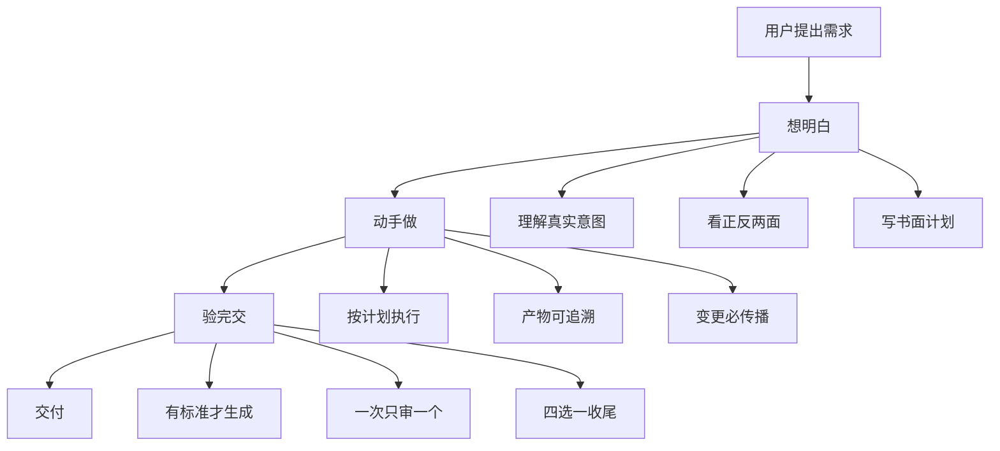
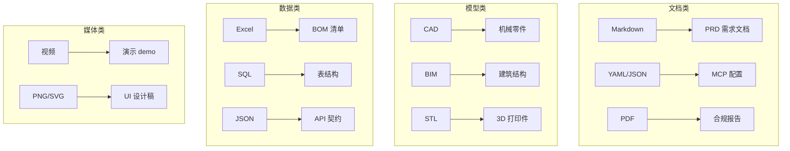
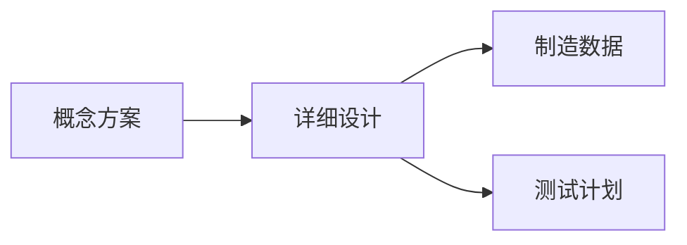
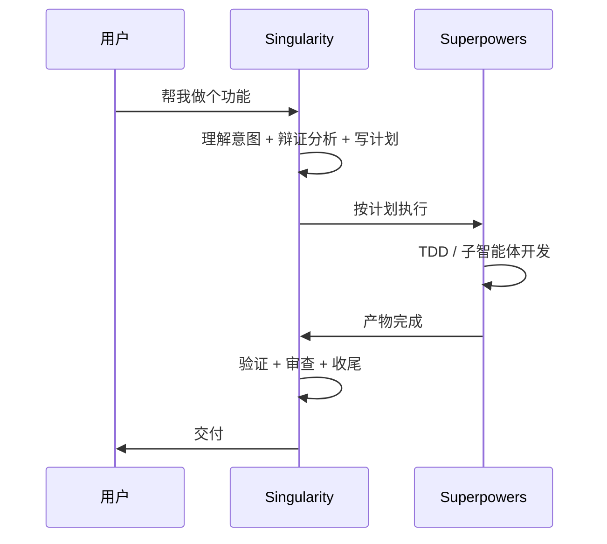
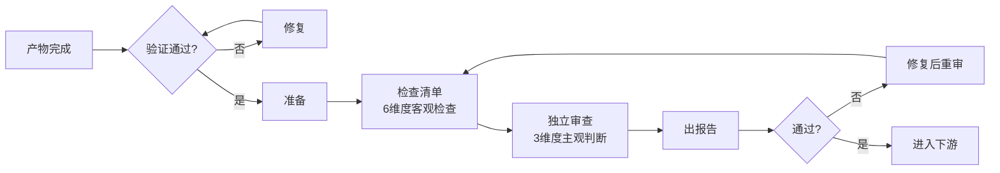

# Singularity · 超级奇点

> **通用工程全链路纪律框架，让 AI 从「能做」到「可信赖」。**

**版本**：v3.1.0 · **许可证**：MIT

---

## 先讲个故事

你让 AI 写个登录功能。它咔咔一顿输出，然后说："完成了！"

你打开一看——没做密码强度校验，没处理并发冲突，登录态也没设计。你问它怎么没做，它说："你没说要啊。"

这就是问题。**AI 不是不会做，是不知道该做到什么程度才算完。**

Singularity 解决的就是这个：**给 AI 立规矩，让它知道什么时候该停、什么时候该问、什么时候该验证。**

不是让 AI 更聪明，是让 AI 更靠谱。

---

## 这套规矩长什么样？

三层，简单到离谱：

```
先想明白 → 再做 → 做完验
```

展开说：

**第一层：动手之前先动脑子**

用户说"帮我做个功能"，Singularity 不会让 AI 直接写代码。它会先问：你真正想解决什么问题？有没有别的方案？风险在哪？

**第二层：做的时候不偷懒**

写计划、按步骤执行、改了上游记得同步下游、新方案替换旧方案时不让旧代码拖后腿。

**第三层：做完别直接说完成了**

有验收标准才能开始生成。一次只审查一个产物。审完别悬着——归档、发布、废弃、回滚，四选一。



---

## 产物不只是代码

Singularity 管的是**任何可交付物**，不是只有代码。

一个 Markdown 的需求文档、一份 YAML 的配置、一张 UI 设计稿、一个三维 CAD 模型、一段语音脚本、一份 PDF 合同——都是产物，都适用同一套规矩。



---

## 产物之间怎么关联？DAG

产物不是孤立的。PRD 改了一个需求，设计稿、技术方案、测试用例都要跟着变。

Singularity 用 **DAG（有向无环图）** 管理这种依赖。

### 最简单的例子

概念方案 → 详细设计 → 制造数据 + 测试计划



概念方案改了，详细设计必须同步，制造数据和测试计划跟着更新。

### 依赖怎么建立

每个产物是一个节点，在 `workflow.yaml` 里声明：

```yaml
- id: "设计稿"
  inputs:
    - "PRD.md"          # 引用上游输出
  output:
    path: "design.md"
    type: "design"
```

**关键在这里**：节点 B 的 `inputs` 引用了节点 A 的 `output.path`，DAG 边就自动形成了。

```mermaid
graph LR
    A[PRD<br/>output.path: PRD.md] --> B[设计稿<br/>inputs: [PRD.md]]
```

改了 PRD，DAG 引擎自动扫描下游，标出设计稿、技术方案、测试计划——哪些要同步。

---

## 和 Superpowers 的关系

一句话：**Singularity 管"该不该做"，Superpowers 管"怎么做"。**

| | Singularity | Superpowers |
|--|-------------|-------------|
| 管什么 | 纪律约束 | 技术实现 |
| 回答 | "先理解还是先动手？" | "怎么写测试？" |
| 产物 | 任何可交付物 | 主要聚焦代码 |

**实际怎么配合？**



Singularity 先定规矩，Superpowers 按规矩干活。配套使用，缺一不可。

---

## 审查：一次只审一个

审查不是走形式。Singularity 的审查流程长这样：



**一次只审一个产物**。出一份报告，主角是一个产物。但审查过程中可以查阅上游产物作为参考。

---

## 14 个核心纪律

`using-singularity` —— 每次会话自动加载纪律栈  
`objective-analysis` —— 先理解真实意图，再行动  
`dialectical-thinking` —— 没有对立面分析，不得形成结论  
`plan-before-execution` —— 没有书面计划，不得执行  
`complete-task-execution` —— 不跳步、不偷懒  
`evidence-before-claims` —— 没有验证就不能声称完成  
`systematic-problem-solving` —— 没有根因调查就不能提出解决方案  
`clean-evolution` —— 新方案替换旧方案  
`artifact-workflow` —— 产物依赖可追溯、变更必传播  
`acceptance-criteria-first` —— 没有验收标准不得生成内容  
`artifact-review` —— 一次只审查一个产物  
`artifact-finishing` —— 归档 / 发布 / 废弃 / 回滚 四选一  
`artifact-isolation` —— 并行开发不互相污染  
`idea-evaluation` —— 未经 gap 分析禁止直接输出产物

---

## v3.1.0 改了什么

- `audit-framework` + `review-before-acceptance` 合并为 `artifact-review`，统一审查入口
- `evidence-before-claims` 从审查子步骤变为**前置条件**
- 审查流程引入 DAG 引擎做端到端链检查
- 移除"机械检查"概念，所有检查统一由 AI 执行

---

## 快速开始

```bash
git clone git@github.com:HKweiguang/super-singularity-zh.git
```

在 Kimi Code 中加载插件，会话启动时自动激活。

---

Singularity 不是一个银弹，是一套**让 AI 在通用工程领域变得更可信赖的纪律契约**。
